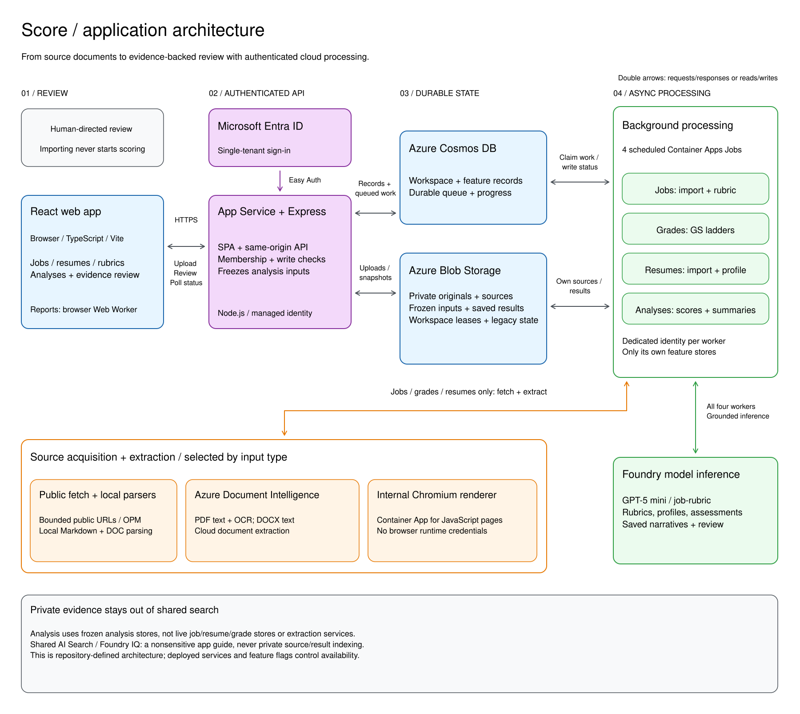

# Score

A jobs-first workspace for comparing resumes against clear criteria, with every score connected to its supporting evidence.

**Authenticated cloud mode supports real job and resume imports, source-grounded GS ladders, and manually requested evidence-backed analyses.** Microsoft Entra authentication and workspace membership protect private sources and results. Each real feature requires its configured stores and deployed worker; this repository does not imply that an existing Azure environment has been upgraded. Standalone local mode and the separate **Samples** views remain fictional. Scores are document-evidence review aids, not official GS eligibility findings, intrinsic measures of a person, or hiring decisions.

## Architecture



[Full-size SVG](docs/architecture.svg) | [Editable Excalidraw source](docs/architecture.excalidraw) (open with [Excalidraw](https://aka.ms/excalidraw)).

The diagram describes the repository's cloud architecture, not the verified state of a live deployment. Cosmos feature records also form the durable work queue; there is no separate message broker. Each worker uses its own feature stores, and explicitly requested analyses consume frozen inputs. Report files are generated by a browser Web Worker, not the hosted Chromium renderer. Standalone samples remain browser-only, cloud samples have separate saved state, and private evidence is never indexed into shared Foundry IQ or AI Search.

## Run locally

Use Node.js 24 and npm.

```powershell
npm install
npm run dev
```

Open the local URL printed by Vite, normally `http://127.0.0.1:5173`.

```powershell
npm run build
npm run lint
npm run test:server
npm run test:worker
npm run test:renderer
npm run test:reports
node --test src\services\*.integration.test.mjs
npm run preview
```

Standalone Vite mode uses the browser-only sample workspace. Real imports require the authenticated Azure API and processing services; `VITE_DEPLOYMENT_MODE=cloud` selects that integration at build time and never substitutes samples when the services are unavailable.

The application uses React 18, TypeScript, Vite, Tailwind CSS, React Router, and accessible Radix dialog primitives. Styling is custom: restrained glass surfaces, a warm light theme, and a charcoal dark theme. Theme colors are centralized in `index.html` as Clawpilot CSS variables. Light, Dark, and System preferences are supported; the host's `scoutTheme` query parameter takes precedence when supplied.

## Explore the workflow

In the cloud app, start at **My workspaces**. Choose a workspace, reopen one from **Recent workspaces**, or, when authorized, use **New workspace** to give a new one a name. Owners and application Admins can manage sharing from the home cards or workspace picker. Cards show active **real** jobs, resumes, and analysis runs, not fictional samples or archived content. Counts load independently; an unavailable count is not zero and does not prevent opening the workspace. Use **All workspaces** in desktop/mobile navigation or the application logo to return home. Opening a saved workspace or record link still takes you directly there.

1. **Jobs:** In Azure, choose **Real jobs**, then **Add jobs** to upload actual PDFs or advertised Markdown files (`.md` / `.markdown`), plus DOCX and legacy DOC when Word imports are enabled, or import direct public posting URLs. Each input creates its own job and associated rubric. The separate **Samples** view and standalone local mode expose fictional jobs and simulated discovery; the OPM preset is not a live website integration.
2. **Resumes:** In cloud mode, upload actual PDFs, advertised Markdown files, or enabled Word formats, or enter public resume/profile URLs, one per line, with up to 10 total inputs per batch. Inspect ready documents, provenance, and item-level errors. The separate sample library still contains fictional profiles.
3. **Rubrics:** Review job-specific criteria or choose **Create grade ladder** from a real job to prepare separate GS levels. Inspect the selected sources and grade matrix before approving supported versions. Sample GS rubrics remain separate. Weights must total 100.
4. **Analyses:** Select ready real resumes and saved real job rubrics or exact approved GS versions, review the comparison count, then explicitly start the run. The limit is 500 resume/target pairs. Importing never starts scoring automatically. Sample analyses use a separate fixture scorer that rejects real or mixed selections.
5. **Evidence:** Open a comparison to inspect its saved assessment narrative, criterion assessments, an available weighted 0-100 score, evidence gaps, and exact resume quotations beside the frozen job/GS requirement citations. **Manage summaries** can generate missing narratives or regenerate them without rescoring. Results retain their original documents, rubric versions, and approval provenance even after later edits.
6. **Reports:** Open a saved analysis and choose **Export report** for CSV, PDF, Word, or PowerPoint. Export the entire group or one exact job/grade. PDF, Word, and PowerPoint require current saved narratives for the selected scope; CSV does not. All formats focus on completed reviews. Word matches PDF's content and section order in an editable document.

Saved comparison scores, criterion assessments, and frozen evidence load independently of candidate summaries and job/grade overviews. Each summary has its own loading, retry, and error state; a slow or failed summary does not hide a valid assessment. Opening one comparison does not download the published narratives of every other candidate. Summary generation and report readiness still use the exact selected scope and saved revisions.

Jobs, Resumes, and Analyses support reversible column sorting and a sorting selector, including on smaller screens. Sort names and labels alphabetically, counts numerically, dates chronologically, or processing status with attention-needed or completed work first. The default-order option restores each view's original order. Sorting does not change selections or saved records; processing completion is not a record of human review.

Use the **Rename** controls in analysis, job, and resume lists or details to organize saved work. Names are trimmed, nonempty, and limited to 160 characters; duplicate labels are allowed. Job display titles and resume labels are separate from extracted titles, stated names, and original filenames. Analysis renaming changes its displayed title and newly generated report names without running another assessment. Future analyses capture the current display labels; existing comparisons keep their captured labels, sources, scores, and citations. Reports distinguish custom labels from source identities; CSV adds separate display-label columns when custom labels are present.

New analyses suggest a name based on the selected target and resume count, or the resume/target counts for a multi-target run. Entering your own name takes precedence. Workspace Owners and application Admins can rename from workspace-home cards or the workspace picker. Rubric names and descriptions are editable through **Edit rubric** and save a new rubric version; grade-ladder name/context edits retain their existing source-confirmation requirements.

Jobs, Resumes, Analyses, and Rubrics remember library searches, filters, and sorting when returning from a detail view. This state stays only in memory for the current workspace, separately for real data and samples, and resets on reload or a workspace/session change. Private search text is not added to URLs or browser storage. Name and rubric editors warn before discarding unsaved changes, retain drafts on failed saves, and wait for an in-flight save to be acknowledged before leaving. Read-only or archived content cannot be renamed; concurrent changes require an explicit reload and review rather than an automatic overwrite.

Inside an analysis, **Search comparisons** finds saved candidate names, roles, document labels, and job or grade names. Choose one exact target before sorting evidence-match scores high-to-low or low-to-high; **All targets** keeps the separate comparisons visible without combining their scores into a ranking. Missing or withheld scores stay after numeric scores in either direction, and zero remains a real score. Search, target, and sort choices remain in place while opening a comparison and returning, but reset when leaving the view or changing runs/workspaces. Searches use saved summary metadata, not full document text, and are not stored in browser storage or URLs.

Use the sample import and analysis **Demo scenario** controls to explore simulated failures, partial results, cancellation, and retry. Real imports and analyses instead show durable server progress and actual processing errors. One inaccessible URL or failed comparison does not discard successful items.

Custom criteria in sample rubrics have no fixture assessment. They are explicitly marked not assessed, and the overall score is withheld rather than invented. Other mock scores follow synthetic evidence profiles; editing sample criterion wording does not invoke a real assessment. Real analyses evaluate the exact saved criteria, including custom wording, against the frozen resume evidence.

Sample GS examples are illustrative. Source-backed grade drafts and real assessments also require human review and are not official OPM classification or eligibility determinations. Missing resume evidence does not prove a person lacks a skill. Do not treat a score as a hiring recommendation or automate employment decisions from it.

## Real job ingestion

The authenticated API accepts raw PDF or UTF-8 Markdown bytes, DOCX or genuine Word 97–2003 DOC bytes when the Word admission gate is enabled, or a direct public HTML/PDF URL. **Markdown and Word are file-upload only, not URL ingestion.** One input must describe one job; listing/search pages and whole-site discovery are outside this release.

1. The API checks workspace membership, validates the input, and publishes an idempotent job record. Uploaded originals are stored immutably in the private `job-sources` Blob container before publication.
2. A Container Apps Job runs every minute, claiming pending Cosmos records with ETag leases and heartbeats. Processing continues after the browser closes; an import may wait about a minute before starting.
3. Azure Document Intelligence extracts PDF text, performs OCR on scanned PDF pages, and extracts DOCX text. Legacy DOC text is extracted locally in a bounded Node parser, without Word, LibreOffice, Python, or another service. Markdown is strictly decoded as UTF-8 and parsed locally with `marked` into ordered, citable text with headings, lists, tables, and code; it uses neither OCR nor a browser renderer. URLs use bounded HTML/JSON-LD extraction, with a separate private Chromium renderer when JavaScript is needed. Direct links that return PDFs use the same PDF pipeline.
4. Foundry generates a schema-constrained rubric from the extracted source. Criteria include required/preferred distinctions, 0-5 scoring guidance, weights totaling 100, and exact paragraph quotations. Metadata, weights, and citations are validated before publication; invalid output is repaired once or reported as an error, never replaced with a sample rubric.
5. Open the job to inspect its source beside the saved rubric. Citation links highlight the original passage, and the original file remains downloadable through the authorized API. Reviewer edits require the current job ETag and append an immutable rubric version.

| Limit | Current value |
| --- | --- |
| Uploaded file size | 10 MiB per PDF, Markdown, DOCX, or DOC |
| PDF page count | 50 pages; this limit does not apply to Markdown or Word |
| Import batch | Up to 10 inputs; each remains an individual job |
| Normalized source text | 180,000 characters |
| Direct URL length | 4,096 characters; public HTTP(S), standard ports only |
| Rubric | Up to 20 criteria; weights must total 100 |
| Transient processing failures | Up to three automatic attempts with backoff; explicit retry after failure |

Jobs expose queued, parsing, generating, ready, error, and cancelled states. Cancellation prevents late worker results from being published. Retrying reuses any preserved original and extracted source instead of silently changing the evidence. Encrypted/unreadable documents, invalid Markdown encoding, unsupported formats, protected websites, and invalid generated output produce actionable errors. Public URLs do not carry the user's browser login, cookies, or credentials.

Markdown uploads accept `.md` and `.markdown` extensions case-insensitively, with UTF-8 encoding (an optional UTF-8 BOM is supported). Empty, binary, invalidly encoded, and oversized inputs are rejected explicitly; extracted text is never silently truncated. Original bytes and filenames remain downloadable. The evidence viewer shows Markdown as text sections with citation highlighting, not as executable HTML or a rendered Markdown page. Embedded HTML and front matter remain inert text, and linked images/assets are never fetched. Markdown URL ingestion, Markdown export, and Markdown supporting-reference uploads for GS ladders are not included.

When upgrading from workers without Markdown support, deploy the updated job, resume, grade-ladder, and analysis workers before the Markdown-capable web/API release so older workers never encounter Markdown records or snapshots. The authenticated feature response advertises `markdownJobImports` and `markdownResumeImports` separately, based on the corresponding real backend's availability; Markdown needs no new global environment flag. Missing or false Markdown capability fields do not enable Markdown uploads in the UI. The separate Word admission gate does not pause Markdown imports.

### Source isolation and model processing

Real jobs live in Cosmos `job-records`, partitioned by workspace. These records are also the durable work queue; there is no separate queue publication that can get out of sync. Originals and normalized source documents live in `job-sources`. They are not part of the legacy sample-state autosave and are not overwritten by sample reset or workspace snapshots.

The dedicated worker identity can access job records/sources, Document Intelligence, and Foundry inference, but not the legacy workspace-state Blob container or shared knowledge contents. Public HTTP requests use DNS-pinned connections, validate every redirect, and reject private, loopback, metadata, and other reserved addresses.

In the hosted deployment, Chromium runs only in an internal-ingress Container App, separate from the credentialed worker. Its dedicated identity is for ACR image pulls only, with runtime identity access disabled. Startup verifies that the identity broker cannot issue a token, then removes broker variables before launching browser code. Browser requests use the same restricted public transport; fresh contexts have bounded time, request count, and response sizes, with no persistent profile, downloads, service workers, or WebSockets.

PDF and DOCX job bytes are sent to Azure Document Intelligence for extraction; DOC extraction runs locally with the pure-Node `word-extractor` parser, and Markdown extraction runs locally with `marked`. Extracted text from all supported formats is sent to the configured Foundry model for rubric generation. The infrastructure configures **GPT-5 mini (`2025-08-07`), deployment `job-rubric`, Data Zone Standard**. The Foundry resource is configured in North Central US, but model inference uses the **US data zone**, not a guarantee of North Central US-only processing. Generated rubrics need human review; exact citations establish traceability, not correctness of every interpretation.

### Uploaded formats, evidence, and private Word previews

Markdown and Word support applies only to **real job-description and resume file uploads**. It does not change sample imports, add Markdown/Word URL ingestion, or permit independent agency/OPM reference Markdown/Word uploads. A ready Markdown- or Word-backed job can still seed a GS ladder, and those ready jobs/resumes can participate in explicitly requested real analyses.

| File format | Canonical upload MIME type | Extraction and preview |
| --- | --- | --- |
| PDF | `application/pdf` | Existing Document Intelligence text/OCR and PDF-page evidence |
| Markdown (`.md` / `.markdown`) | `text/markdown` | Strict UTF-8 decoding and local `marked` text extraction; text-section evidence, never an HTML preview |
| DOCX | `application/vnd.openxmlformats-officedocument.wordprocessingml.document` | Existing Document Intelligence text extraction; optional approximate formatted preview |
| DOC | `application/msword` | Local binary Word text extraction; extracted-text preview only |

The **10 MiB file**, **10-input batch**, and **180,000 normalized-character** limits apply to all supported uploads. The **50-page limit is PDF-only**. Markdown uses `markdown-sections`; Word uses `captured-sections`. Both have null physical page counts and stable paragraph citations; Document Intelligence's DOCX processing units are not printed Word pages. Tables, headings, and other available text contribute to the same bounded evidence, not a separate scoring path.

DOCX formatted previews use Mammoth in a cancellable browser worker, sanitize the untrusted result with DOMPurify, and display it in a restrictive sandbox/CSP. They approximate headings, lists, tables, emphasis, and supported raster images; they do **not** reproduce Word pagination or exact layout. Preview formatting is never scoring evidence: citations return to the authoritative extracted-text view. Preview conversion failures remain visible and do not invalidate a successfully extracted document. Legacy DOC previews show extracted text, not Word formatting.

The browser fetches original bytes only from authenticated, same-origin, workspace-authorized endpoints. No public Blob link, external Office/Google viewer, or third-party preview/conversion upload is used; originals and preview HTML are not persisted in browser storage. External resources and active content are not executed. The original bytes remain unchanged and privately downloadable.

DOCX ZIP structure/expansion and legacy DOC structure are checked with bounded, terminable local parsing. Renamed ZIP/OLE files, mismatched MIME/extensions, corrupt or encrypted documents, DOCM, RTF, and templates are not supported. Macros and embedded objects are never executed. **OCR of embedded or linked Word images is not supported**: export an image-only or scan-heavy document to PDF and use the existing PDF/OCR workflow.

### File upload API and compatibility

These paths have prefix `/api/workspaces/:workspaceId` and require authentication, workspace write authorization for imports, and the existing same-origin CSRF headers (`Origin` and `X-Score-Request: workspace`).

| Method and path | Contract |
| --- | --- |
| `POST /jobs/file` | Canonical raw PDF/Markdown/DOCX/DOC upload; `{ job }`, 202 on acceptance or 200 on confirmed replay |
| `POST /jobs/pdf` | Existing strict PDF-only alias; unchanged PDF fingerprints and replay behavior |
| `POST /jobs/markdown` | Existing Markdown-only upload endpoint; strict UTF-8 `text/markdown` and `.md` / `.markdown` filename |
| `POST /resumes/file` | Canonical raw PDF/Markdown/DOCX/DOC upload; `{ resume }` with ETag, 202 on acceptance or 200 on confirmed replay |
| `POST /resumes/pdf` | Existing strict PDF-only alias; unchanged PDF validation and receipt replay |
| `POST /resumes/markdown` | Existing Markdown-only upload endpoint; unchanged Markdown validation and receipt replay |
| `GET /jobs/:jobId/original` | Workspace-authorized private original attachment |
| `GET /resumes/:resumeId/original` | Workspace-authorized private original attachment |

Send the matching canonical `Content-Type`, percent-encoded safe basename in `X-File-Name`, and a UUID `Idempotency-Key` per input. Markdown permits `text/markdown` with no charset or `charset=utf-8`; other declared encodings are rejected. Send original bytes, not multipart or compressed request bodies. Job file imports retain optional UUID `X-Import-Batch`; resume imports require UUID `X-Import-Batch` and decimal `X-Import-Count` (1–10), identical across that batch. Filenames are display-only, never storage paths or inferred person identities. After an ambiguous response, keep the same key, bytes, filename, and batch headers rather than creating a replacement item.

Originals use immutable `original.pdf`, `original.md` (also for `.markdown` filenames), `original.docx`, `original.doc`, or URL-captured `original.html` beneath the owning job/resume prefix in its existing private container. Downloads verify ownership, MIME, length, and SHA-256 and remain `no-store`, `nosniff`, attachment-only responses. Original bytes, including Markdown BOMs and line endings, are preserved. Existing history is not rewritten. Resume PDF/URL receipts stay schema version 1, including the existing `pdfSha256` field. Markdown receipts remain version 1 with their separate `markdownSha256` field and fingerprints. New Word receipts use additive version 2 with `fileSha256`; PDFs and Markdown sent to `/file` retain their respective version-1 receipt contracts.

## Source-grounded GS grade ladders

A ready real job, including a Markdown- or Word-backed job, can seed a new family of GS grade rubrics without changing the job or its original rubric. Confirm the occupational series and requested grades, review applicable OPM sources, optionally supply agency PDFs/public HTML/PDF URLs, and generate independent grade drafts. Markdown and Word are supported here only as captured seed-job evidence, not as independent reference uploads or URLs. The API captures the exact seed rubric and source so later job edits cannot change the ladder's evidence.

**Automatic discovery accepts any GS occupational series, but does not guarantee that every requested grade has sufficient evidence.** It follows actual classification, qualification, family, functional-guide, and competency-policy references rather than guessing URLs or using model memory as the authority. Agency, supervisory/leader, research, or other applicability questions are surfaced when relevant. A "Program Manager" title alone does not determine the correct series or grading guide.

Source review distinguishes grading, classification, qualification, agency, issuance, and background documents. Captures retain requested/final URLs, intended sections, source relationships, revisions, hashes, extraction details, and exact passage/page references. Named qualification groups and table headers are preserved rather than using the first tab on an OPM page. Contradictory, retired, or superseded references are explicit review issues.

Confirming applicability records the reviewer's scoped decision, not a finding that the document supports every requested grade. It cannot override source-authority conflicts, explicit exclusions, or unsupported claims. Discovery-only capture notices can be resolved by the exact captured document/section. A missing linked reference is resolved only when its exact target is captured and selected in that frozen source set; deselecting it in a later set restores the gap. Resolution provenance and original discovery notices remain inspectable.

The grade matrix aligns competencies across levels while keeping each grade's expectations, weights, guidance, and review status separate. Click a citation to inspect the exact captured reference. Qualification requirements are unscored and separate from weighted work expectations; classification factor points are not presented as hiring-score weights.

Every grade receives deterministic citation/structure checks and a separate model grounding review. **Unsupported grade expectations remain incomplete drafts until supporting evidence is supplied. There is no custom-expectation approval bypass.** Supported grades can progress independently of another grade's gaps or failures. Reviewer approval is recorded against the exact immutable version, review, and source set; it is not OPM certification.

Gaps keep their weight unallocated and can be saved as incomplete drafts. Explicitly source-supported exclusions may remain as unscored, not-applicable matrix rows; approval still requires supported work criteria totaling 100 and a successful independent review of those exclusions.

Draft edits, source updates, and additional grades create new work and versions rather than rewriting approved results. Original files and historical source sets remain inspectable. Closing a browser does not stop accepted processing; retry/cancellation and partial progress are durable.

| Reference limit | Value |
| --- | --- |
| Supporting references | Up to 15, in addition to the captured seed-job context |
| Reference PDF size | 20 MiB; independent of the smaller job-upload limit |
| Selected PDF pages | Up to 250 per reference, 500 across a source set |
| Large references | Explicit page selection and cached extraction chunks; no silent truncation |
| Extracted reference text | Up to 2,000,000 characters per document |
| Model context | Bounded source passages; omitted or insufficient context is not treated as reviewed |
| Grades and criteria | GS-1 through GS-15 may be requested; up to 20 criteria per grade, subject to source support |

Real ladder families, work items, heads, versions, reviews, and approvals are stored in private Cosmos `grade-records`. Originals and extracted reference snapshots are stored in private Blob `grade-sources`, not legacy sample autosave or shared IQ. The separate scheduled grade worker has its own identity and no access to job or legacy workspace stores. It shares the existing model, OCR service, and internal renderer, so normal throttling/backoff still applies.

The cloud feature flag is `REAL_GRADE_LADDERS_ENABLED`. Without configured grade services the UI reports the feature as unavailable; it never substitutes a synthetic ladder.

## Real resume ingestion

The authenticated API accepts actual PDF or UTF-8 Markdown bytes, enabled DOCX/legacy DOC file uploads, and direct public HTTP(S) HTML/PDF resume/profile URLs, including LinkedIn profiles **only when publicly accessible**. Markdown and Word URLs are not supported. Each input describes one person, not a directory of profiles or a crawl. Limits are **10 MiB per uploaded file**, **50 pages per PDF only**, **10 total PDF/Markdown/Word/URL inputs per batch**, **4,096 characters per URL**, and **180,000 normalized source characters**, including headings. A same-named file is not assumed to be the same person; exact source/content repeats produce workspace-local duplicate warnings rather than silently merging profiles.

Accepted inputs continue processing after the dialog or browser closes. Per-item states distinguish queued, parsing, profiling, ready, error, and cancelled. Uploaded originals are stored immutably before work is published; URL workers preserve the captured original and manifest before profiling. The dedicated resume worker uses local Markdown text extraction, the existing Document Intelligence service for PDF/OCR and DOCX, local Node extraction for DOC, resume-aware HTML extraction, the isolated internal renderer when necessary, and the configured Foundry model for evidence-grounded display metadata. Missing names, roles, or other fields remain unavailable rather than being invented from filenames.

Public fetches never use the browser's signed-in session, cookies, or credentials. Sign-in, access-blocked, consent, and challenge pages cannot become ready resumes. A private or blocked profile reports **“This URL is not publicly accessible and could not be processed.”** There is no LinkedIn account integration, authentication/CAPTCHA bypass, or third-party scraping service. Missing pages, network failures, unreadable PDFs, unsupported content, and service outages retain their distinct error messages; not every failure means a URL is private. Sparse but genuine public profiles may provide much less evidence than full resumes.

Static HTML imports honor supported declared encodings and preserve the original capture bytes. Malformed or unsupported encodings produce explicit errors rather than silently replacing characters in names or evidence. If an encoding error prevents import, supply a UTF-8 public profile page, a readable PDF, or a UTF-8 Markdown file.

Inspect the actual document and download its original through workspace-authorized endpoints. Captures preserve source kind, filename or requested/final URL, timestamp, hash, extraction method, and stable document/version/paragraph identities. HTML and Markdown sources are displayed as untrusted text, not executed in the browser. Markdown extraction records section provenance rather than physical PDF pages. Transient errors receive up to three automatic attempts with backoff; explicit retry reuses preserved evidence instead of silently refetching a different profile. Cancellation and lost worker leases prevent late publication.

## Real evidence-backed analyses

Scoring is a separate, **manual** action after import. Choose ready real resumes and real job targets or approved GS rubric versions. The server resolves authorized IDs and exact versions, rejects stale or mixed sample/real selections, and freezes the complete comparison inputs. A newer unapproved GS draft does not replace the selected approved version. The UI shows the resume/target pair count before submission; more than **500 comparisons** is rejected, never silently truncated. For example, 103 resumes against four jobs produce 412 comparisons in one run.

Every comparison is independent. Larger runs use the same bounded background processing and concurrency, so they may take longer. Durable initialization, progress, cancellation, and retry preserve completed results if another comparison fails. Retries use the original immutable snapshots; selecting updated sources or rubrics requires a new run. Original resume quotations, saved job requirements, and historical GS reference captures remain available for inspection.

If cancellation pauses after processing errors or exhausted automatic retries, choose **Resume cancellation** to continue the saved cleanup. This does not restart scoring, replace snapshots, or change completed results. Individual comparisons can be retried only after that cleanup finishes.

The assessment follows the saved criteria and 0-5 scoring anchors. Positive scores require exact citations from the correct frozen resume document. After successfully reviewing the source, absence of supporting evidence is **missing evidence, scored 0/5**, not a claim about the person's ability or proof that they lack experience. Professional confidentiality and sensitive-data compliance are documentary work requirements, not personal-trait judgments. A sparse but readable source can receive zero on every criterion and an available 0/100 total. Unreadable/truncated sources, failed reviews, protected-trait safeguards, and genuine interpretation blockers remain unassessed or failed; a genuinely unassessed positively weighted criterion still withholds the total. Weights are never renormalized. Source-supported GS not-applicable rows remain unscored and zero-weight. **GS qualifications remain separate and unscored for human review**, not official eligibility findings.

Schema/coverage/citation checks and an independent grounding review precede publication; at most **two output corrections total per processing attempt** are shared across assessment validation, grounding-review validation, and semantic reassessment. Changing stages does not reset that budget. Weighted totals are calculated deterministically from validated criterion scores and unchanged rubric weights, not supplied by the model. Full-input context limits fail explicitly without publishing a score or silently dropping resume sections. Model identity, prompt/schema versions, grounding-review results, and frozen input identities/hashes are retained. Traceable quotations do not guarantee correct interpretation: humans must review the evidence and limitations. Different job or grade totals are not combined into a hiring ranking.

### Reviewed corrections of historical evidence gaps

Owners and editors can use **Review withheld scores** to preview historical unassessed criteria and confirm which missing-evidence proposals to submit. Opening a preview or history does not start a model call or change a score. Eligibility is only permission to request a fresh review: source-quality/context blockers, protected traits, zero-weight exclusions, and unscored qualifications are not converted. Contextual citations do not by themselves prove support. The independent reviewer sees the same frozen source and the exact proposed assessment and can refuse a proposed zero.

An accepted correction is durable, leased work with its own request ID, actor, reason, policy version, original/base hashes, immutable proposal, and private linked attempt history. It changes only selected unassessed rows to missing/zero; existing numeric rows, weights, qualifications, and requirement citations remain unchanged. Original completed comparison records, result bytes, and their approvals are never overwritten. A supported fresh grounding review is required before the current-result head and run score counts change atomically. List/detail/report and narrative readers resolve that same head. Failed, cancelled, superseded, or unreviewed proposals do not replace the current result. ETags and stable UUID request keys prevent duplicate requests and stale replays.

Publication creates a candidate-summary sidecar bound to the new result revision and refreshes only the affected target overview. Other candidate summaries and their result hashes are preserved; original narrative sidecars and publications remain historical. Summary failures are separate from score withholding. Use the normal summary retry/history controls for independent provider failures rather than altering scores to manufacture a narrative. Exports pin the selected current result hashes and disclose correction provenance; previously captured results retain their original immutable hashes.

Successful application/worker deployments **automatically enable evidence corrections** by setting `ANALYSIS_EVIDENCE_CORRECTIONS_ENABLED=true` on both the API and analysis worker. No azd opt-in is required, and a previously saved `false` value does not prevent activation. Provisioning and reader replacement keep admission closed until compatible API/UI, worker, history, and report readers are deployed, older workers have drained, and worker verification succeeds. Runtime configurations without an explicit flag remain off; the deployment workflow supplies the enabled setting.

Turning off new correction admission does not make corrected history unreadable, and rollback must retain correction-aware readers. Run/workspace cancellation, archive, deletion, and expired/superseded leases fence publication; deletion also removes correction heads, proposals, and history. Production deployment and correction of existing records remain separate approved actions; correction requests require a fresh comparison of the audited result hashes. No historical correction is requested automatically by deploying or opening this code.

### Analysis failure diagnostics and retries

`invalid-citation` is a local generated-evidence validation failure, not an HTTP rate-limit response or a finding that resume fields are missing. The assessor and independent reviewer select **numbered source passages**, using only `{ "passageId": 17 }` in model citations. Trusted code copies each selected passage's exact text and binds its original paragraph, document version, page, and heading. The model cannot write quotations, splice paragraphs together, or assign citation ownership.

The versioned passage catalog is a lossless model view of the complete frozen resume, not a new extraction or saved document version. Paragraphs longer than the 4,000-character quotation bound are split into exact contiguous slices; evidence spanning paragraphs needs separate citations. Whitespace and punctuation are unchanged, and whitespace-only slices remain in context but are not selectable. Unknown/malformed selections and duplicate citations are rejected. The canonical exact-substring checks still run after resolution, and the independent review still rejects valid but irrelevant evidence or unsupported scores. Existing saved quotations and results are not rewritten.

Correction requests receive bounded, citation-specific findings, the allowed passage-ID range, and optional exact supplemental passages. The complete lossless source view is still supplied, and omitted supplemental passages/findings are counted explicitly. Raw invalid model output is not echoed back. A corrected assessment still needs a supported independent review before publication. Two semantic reassessments can produce up to three saved reviews and six logical model calls; the existing bounded transport retries remain separate. Once the correction budget is exhausted, invalid output fails that comparison without a score or an automatic validation-retry loop.

Transient service failures retain their separate transport retries and up to three automatic processing attempts. **Retry saved pair** starts a fresh processing cycle against the same immutable inputs, so different model output can succeed without the resume changing. Completed comparisons are not replayed. `service-unavailable`, `timeout`, and citation/grounding failures remain distinct.

Failed comparisons keep their frozen resume and target evidence viewers available. Their private diagnostic history explains the failing stage, affected saved criteria or qualifications, actual reviewer disagreements, and safe validation locations. These are **unpublished diagnostic drafts**, not completed assessments or report scores. A readable resume with missing evidence can complete with explicit gaps; a model output that cannot pass validation or independent review remains failed and unscored. The UI distinguishes historical attempts whose detailed reasons were never recorded from attempts whose diagnostic write failed. It does not invent a missing qualification or describe an unexplained failure as an unusable resume.

Each failed processing attempt can retain one immutable artifact in the existing private `analysis-sources` container: at most three validated assessment/review checkpoints and 64 privacy-safe trace events, with omitted event counts. Only the latest reference lives on the comparison; immutable predecessor links provide one-attempt-per-page history without growing a Cosmos array. Retry and later successful completion preserve that history and the original source hashes. Workspace-authorized, `no-store` reads verify artifact digests, source bindings, and citations. Run deletion removes diagnostic artifacts, including unpublished orphan writes, using the existing cancellation and writer fences. No public download URL, new resource, or new data-access grant is introduced.

The analysis worker writes structured JSON events with `component: "score-analysis"` to the existing `ContainerAppConsoleLogs` table. Events include model responses, validation failures, correction attempts, and comparison outcomes, correlated by workspace, run, comparison, processing-attempt, and model-call IDs. An `evidence-catalog` event binds the resume/target snapshot hashes, canonical resume-document hash, catalog version, source character count, and paragraph/passage counts. `citations-resolved` records how many citations passed resolution and canonical validation; it does **not** assert semantic support. Other events retain pipeline/prompt/schema versions, stage, deployment, actual response model when available, correction and transport-attempt numbers, HTTP status, bounded request IDs, durations, measured request size/context/completion bounds, allowlisted finish categories, and privacy-safe citation/schema reason locations. Review telemetry includes allowed issue codes and saved criterion/qualification IDs, never reviewer prose. Raw resumes, quotations, model output, source URLs, credentials, and arbitrary upstream error bodies are not logged; invalid model-supplied passage IDs and schema-property names are omitted or scrubbed. An HTTP 200 followed by `validation-failed` is therefore distinguishable from an HTTP 429 without retaining private content. `diagnostic-write-failed` explicitly reports unavailable private capture without replacing the original processing error.

For an authorized operator investigating a specific saved run:

```kusto
ContainerAppConsoleLogs
| where TimeGenerated > ago(24h)
| where JobName == "<analysis-worker-job-name>"
| extend Event = parse_json(Log)
| where Event.component == "score-analysis" and Event.runId == "<saved-run-id>"
| project TimeGenerated, Event.event, Event.comparisonId, Event.attemptId,
    Event.modelCallId, Event.stage, Event.httpStatus, Event.correctionCount,
    Event.code, Event.reason, Event.outcome, Event.citationDiagnostics, Event.schemaDiagnostics,
    Event.reviewOutcome, Event.reviewIssues, Event.citationCount, Event.pipelineVersion,
    Event.finishReason, Event.inputCharacters, Event.contextCharacterLimit, Event.completionTokenLimit,
    Event.catalogVersion, Event.paragraphCount, Event.passageCount,
    Event.resumeSnapshotSha256, Event.targetSnapshotSha256, Event.resumeDocumentSha256
| order by TimeGenerated asc
```

Deploy and confirm readiness of API/UI readers that accept the optional `failureDiagnostic` and `diagnosticCapture` comparison fields, the diagnostic-history endpoint, two corrections, and three grounding reviews **before** activating the updated analysis worker. The `azure.yaml` web deployment precedes its post-deploy worker update; preserve that compatibility order. After diagnostic metadata or expanded provenance has been saved, any rollback must retain compatible API and worker readers rather than rejecting historical records. Legacy comparisons without diagnostics remain readable. Deployment and retries of an existing failed cohort require separate approval; neither happens automatically, and details discarded by older workers cannot be reconstructed from aggregate logs.

Passage selection changes only the worker's model-facing contract (assessment/grounding prompts v3, transport schemas v2, catalog `score-analysis-passages-v1`). Stored results keep their existing literal-citation format and schema; no source rewrite, new resource, model switch, or permission grant is needed. Investigating private source content still requires authorized workspace access: monitoring access alone does not grant access to the underlying resumes. A download affordance is not the scoring input; assessment uses its embedded frozen normalized document.

### Saved analysis summaries

Real analyses keep narrative summaries separately from the immutable scoring results. Each completed resume/job comparison has an assessment summary and a short overview; each exact job or grade has an overview of its saved assessments. Concise prose is guidance, not a publication gate. New version-2 summaries are not rejected for sentence counts, abbreviations, equivalent number formats, accurate mentions of saved scores, or omission of minor details. Basic nonempty response shapes and high technical resource bounds still apply. Summaries describe documented strengths, distinctions, and gaps; they do not turn scores into a hiring recommendation or official eligibility finding. The numerical scores, coverage, source quotations, and separate GS qualification notes remain unchanged.

New completed assessments schedule candidate summaries in the analysis worker. A job overview waits until that target's comparisons have settled and its completed candidate summaries are ready. Retrying unfinished comparisons marks the affected overview outdated; after the work finishes, it is regenerated using the updated saved results. Summaries use the configured analysis model and frozen evidence, not newer live job or resume versions. Summary failures are reported separately and never turn an already completed assessment into failed scoring.

Choose **Manage summaries** within a saved analysis to select all its targets or one exact job/grade:

- **Generate missing summaries** preserves current candidate summaries, fills missing or failed summaries, and updates missing/outdated job overviews.
- **Regenerate all summaries** creates new versions of the selected completed-candidate summaries and job overviews. Confirmation makes clear that this does **not** rerun scoring or change saved evidence.
- **History** (owners and editors) opens full saved drafts, factual findings, round/model/version/timestamp metadata, and paginated earlier attempts. Supporting target reductions are visible provenance, never selectable final summaries.
- **Use this draft** explicitly publishes an exact saved draft with **manual approval**, its recorded review outcome, and known-issue disclosure. This is human approval, not an automated pass. The disclosure remains visible to readers and in narrative-bearing reports; alternate drafts stay private.
- **Resume saved attempt** resumes a failed/cancelled generation with its captured model settings, saved checkpoints, and remaining review budget. It does not adopt newer Admin settings or grant additional review rounds.
- **Restart with current settings** requires explicit confirmation and starts a new generation for that candidate summary or target overview only. It captures current settings and a new bounded review budget, preserves prior publications/history, and fences late results from superseded work. Restarting an overview leaves candidate summaries and other overviews unchanged; changing a candidate summary also refreshes its dependent overview. Older API responses retain the legacy **Retry this summary** control rather than advertising an unsupported restart endpoint.

Old analyses can use these actions without reimporting sources or rerunning candidates. Merely opening history does not start model work. Summary work is durable and continues after closing the browser; progress, waiting dependencies, and failures are visible separately from scoring. A previous published narrative remains readable during replacement, but is not treated as the current ready generation. Scope is always the current saved analysis, optionally one target, never every analysis in the workspace or a candidate search-filter subset.

Owners/editors can inspect private history, including on archived analyses, but publishing, resuming, or restarting requires a writable, non-deleting analysis/workspace and current capabilities. Viewers can read published summaries and manual disclosures, not private draft history or its controls; the API enforces the same role boundary. Mutations require the current summary ETag and stable UUID request key. An ambiguous acknowledgement can be repeated with the same key rather than creating duplicate work. Restart additionally requires `POST .../summaries/:kind/:subjectId/restart` with `{ "confirmRestart": true }` and current new-work admission; an accepted-generation resume retains its original admission/settings. The `analysisSummaryGeneration` capability is separate from `realAnalyses` new-run readiness. Historical summary work needs the analysis stores and worker, not the current live source-import services. Cancellation, archive, and deletion fence new publication, and deletion cleans up owned narrative versions and private history along with the analysis.

The summary-only factual checker compares a draft with the supplied saved assessment, not a fresh resume assessment. It checks invented facts, contradictions, changed measurements/scores, and materially misleading assertions—not exact wording, sentence counts, or exhaustive citation/detail repetition. The default is **three total generate-and-review rounds: the initial draft plus up to two revisions**. Each revision receives the previous draft and accumulated findings; supported output stops early. Durable checkpoints retain every usable draft and review on both success and failure. Worker process restarts and **Resume saved attempt** do not reset the captured round budget. An explicit new-generation request captures a new budget; the dedicated **Restart with current settings** action requires confirmation. Transport retries remain separately bounded. After the review budget is exhausted, an owner/editor may inspect, manually publish, or explicitly restart with current settings.

Narratives retain their result/input hashes, model/prompt/schema identity, generation, and factual review. They have separate revisions, so summary work never changes completed results, scores, criteria, citations, manifests, frozen snapshots, or their existing hashes. Large job overviews account for all completed comparisons, not only featured candidates; manually approved candidate prose is not a new source of assessment facts. Legacy version-1 publications remain readable without rewriting or rehashing; samples keep their existing explicitly fictional fixtures. Failures predating history capture honestly report that history was not recorded—discarded drafts cannot be reconstructed.

Full draft and reviewer text is stored only in the existing private analysis store and returned through authorized, `no-store` history reads. The UI renders it as escaped text and never persists it in browser storage. Routine logs contain only allowlisted correlation IDs, round/stage/version metadata, technical budgets, and issue codes/counts; no draft/reviewer text, source excerpts, personal URLs, or raw upstream bodies. Reading history and exporting never starts model work.

Roll out compatible API, UI, artifact, and report readers **before activating version-2 summary workers or workers that persist retry diagnostics**. New HTTP-status/retry-at checkpoint metadata is optional for legacy data, but older strict readers do not recognize it. Keep compatible readers on rollback after new metadata/history has been written. This needs no new store, model deployment, or broad permission grant. Deployment, production changes, and paid retries of existing failures require separate approval; checking out this code does not perform them.

### Recovering interrupted or throttled summaries

**Manage summaries** distinguishes provider cooldown, eligible queued work, long-queued work, valid running leases, expired leases, and unmet prerequisites. Each subject shows available queue/progress timestamps, lease expiry, retry time, and sanitized failure details. An expired running lease is **interrupted**, not proof that inference is still active; a long queue alone does not prove a global worker outage. Previous transient errors do not turn queued/running subjects into failed-count entries. Derived health and its polling revision do not change summary-scope ETags or publication readiness. Single-summary actions still require the exact current record ETag returned by History.

Provider `Retry-After` (seconds or HTTP date) and millisecond retry headers are honored within bounded transport/operation limits. Delays that cannot fit the remaining operation budget are carried into durable `nextAttemptAt` scheduling instead of occupying a worker indefinitely or immediately repeating a throttled call. Resume retains successful checkpoints and the accepted review/processing policy.

For a run with **412/412 candidate summaries ready and only two of four overviews ready**, recover the two unfinished overview subjects, not the completed candidates:

1. Read the affected run through the authorized app/API, inspect each unfinished overview's history and health, and compare worker executions with provider telemetry. Check for HTTP 429 cooldowns, expired leases, startup validation failures, claim pauses, and deployment/configuration drift. Do not rewrite Cosmos statuses or obtain account keys to bypass an authorization failure.
2. Restore worker startup before trying to clear the queue. On the compatibility deployment, the bootstrap triplet is `RUBRIC_MODEL_DEPLOYMENT=job-rubric`, `RUBRIC_MODEL_NAME=gpt-5-mini`, `RUBRIC_MODEL_REASONING_EFFORT=low`; verify the actual Azure deployment before any separately approved repair. Environment model names describe a deployment, not select a different model. Changing the name to Luna while still sending requests to `job-rubric` does not switch inference to Luna.
3. Deploy compatible readers and workers before selecting newly supported models. Use saved **Admin settings** to bind `candidateSummary`, `targetSummary`, `summaryReduction`, and `summaryReview` to the intended existing deployment. The recognized Luna adapter supports `gpt-5.6-luna` version `2026-07-09` with low/medium/high reasoning. Selecting an existing **GlobalStandard** deployment requires explicit acceptance of that processing boundary; it is not the previous US DataZoneStandard guarantee. Do not silently switch unrelated scoring tasks or rewrite accepted settings.
4. A healthy worker can reclaim an expired lease and finish accepted work using its captured settings. **Resume saved attempt** keeps those settings and checkpoints. To deliberately adopt current settings or supersede stuck work, open the exact overview's **History**, choose **Restart with current settings**, and confirm. Do not use **Regenerate all summaries** or rerun scoring for this recovery.
5. Verify the selected overviews become current/ready, candidate publications and unrelated ready overviews retain their revisions, and saved results/evidence hashes are unchanged. Observe successful worker executions and retry times rather than treating an accepted HTTP request as completed recovery. Opening history and exporting never start model work.

Startup failures emit one JSON event containing an allowlisted phase, configuration field and reason, never raw exception messages or environment values. For environments using resource-specific Azure Monitor logging, query `ContainerAppConsoleLogs` / `Log` (not the legacy `_CL` / `_s` names):

```kusto
ContainerAppConsoleLogs
| where TimeGenerated > ago(30m)
| extend e = parse_json(Log)
| where tostring(e.component) in ('score-analysis-worker', 'score-analysis-narrative')
| project TimeGenerated, event=tostring(e.event), code=tostring(e.code),
    phase=tostring(e.phase), field=tostring(e.field), reason=tostring(e.reason),
    runId=tostring(e.runId), targetId=tostring(e.targetId),
    httpStatus=toint(e.httpStatus), retryAt=tostring(e.retryAt),
    deployment=tostring(e.deployment), model=tostring(e.model)
| order by TimeGenerated desc
| take 100
```

### Analysis report exports

Choose **Export report** from a real or sample analysis, including while inspecting an individual comparison. The default is the **entire grouped analysis**, not just the open comparison. A multi-target run can be narrowed to one exact saved job or grade. Workspace Readers can export the history they are authorized to read, subject to application export policy; new-run readiness and Word-upload admission do not control historical exports.

Archived analyses remain exportable for authorized readers. Analyses being permanently deleted or already removed cannot be exported; deletion or loss of read access cancels an open export rather than downloading stale cached evidence. Table search and sort controls do not silently narrow the report's explicit export scope.

| Format | Contents |
| --- | --- |
| CSV | One header row and one row per completed candidate/job review: name, job/grade, overall score, concise assessment, C1–Cn criterion scores, analysis date, source, and links to the analysis, resume, and job/grade. |
| PDF | A searchable report with an introduction and linked contents; each job section contains separate title/organization, saved analysis overview, featured candidate reviews and scorecards, then every completed candidate at a glance. |
| Word (`.docx`) | The same content and section order as PDF, with editable native text/tables, matching typography and page geometry, linked contents, headings, and live page numbers. |
| PowerPoint (`.pptx`) | An editable widescreen deck with a visual count-based cover and linked agenda; each job section contains context, saved overview, featured reviews, then candidates at a glance. Long v2 summaries and manual disclosures continue across slides. |

Featured reviews use the **top five scored candidates within each exact saved rubric**, including ties at the fifth-candidate cutoff up to ten featured reviews. The selection and saved scores are unchanged; concise reports do not print rank numbers, cutoff statistics, or administrative identifiers. Every completed review, including those without an overall score, remains in the score-ordered overview and CSV. Different jobs/grades are kept separate, even when their titles match; they are never combined into a hiring ranking.

Legacy PowerPoint candidate sections retain their existing three-slide layout. Longer accepted v2 prose and manual-approval disclosures flow to additional slides, including continued overview-table rows; no accepted summary is clipped or rejected merely to meet the old prose/layout limit. When a large scorecard cannot fit at a readable text size, the deck still shows **Key criteria**, balancing important strengths and gaps, and links to the full scorecard. Full job titles and organizations are separate, wrapped fields; long job context and agendas can continue as needed. PDF and Word use their existing full-text pagination and retain every criterion for featured candidates. Full evidence and technical records remain available in linked app reviews; report layout does not alter saved results.

The export dialog becomes available after at least one comparison completes, even if its overall score is withheld. **PDF, Word, and PowerPoint additionally require the complete selected target scope to have settled scoring and current, revision-pinned candidate summaries and job overviews.** Automatically reviewed and manually approved current publications are usable; manual labels and known issues travel with the text rather than claiming automated support. Unpublished drafts never qualify. Missing, outdated, failed, or in-progress summaries block those downloads and direct the reviewer to Manage summaries. A ready single-target export is independent of other targets still processing. CSV retains its previous score/assessment contract and does not depend on summary generation.

Reports show **Reporting on X of Y candidates** (or **candidate-job reviews** for multiple targets) and explain failed/cancelled or otherwise excluded reviews once. Cover counts distinguish unique reviewed candidates from candidate-job comparisons. All formats include completed assessments only; unfinished comparisons are never represented as zero scores. Status is captured during export, so later completions are not added to that file. PDF, Word, and PowerPoint capture and recheck the selected narrative revisions rather than mixing generations across batches. Completed results must still be retrieved and verified in full: an access, evidence, revision, or generation failure stops the download. Closing the dialog or leaving the workspace cancels preparation.

CSV's C1, C2, and subsequent columns follow the saved criterion order for that row's job, with names and weights available in the linked review. Criterion scores use a 0-5 scale. Jobs reuse these columns instead of multiplying spreadsheet width; unused cells are empty. A numeric zero stays zero; `Not assessed` and `N/A` remain distinct. An unavailable overall score has an empty numeric cell and its reason in **Overall assessment**. UTF-8 BOM, quoted multiline fields, and CRLF records support spreadsheet import. Untrusted text beginning with spreadsheet formula markers is prefixed with an apostrophe. Links are plain absolute URLs, not spreadsheet formulas. Sample CSVs identify fictional data in the first column heading and filename rather than repeating a data-status column.

PDF/Word contents entries and PowerPoint agenda entries use native internal links to the exact job/grade section, including when titles repeat or sections span several pages/slides. These internal links are distinct from source links. All three formats link each featured candidate to **View analysis**, **View resume**, and **View job** (or **View grade requirements**). Overview names also link to the analysis. These open the saved review and the frozen sources used for that assessment, not newer library versions. Source links require the recipient's workspace access and do not embed credentials or grant access to private documents. Standalone sample links refer to the local app and its saved sample state.

Reports reuse the selected current saved scores and evidence, including an explicitly reviewed correction revision where one exists; **exporting does not invoke AI, enqueue summaries, or reassess candidates**. PDF, Word, and PowerPoint read full saved narrative and overview text instead of manufacturing summaries during export. CSV retains its existing concise assessment and exact criterion columns. GS qualification concerns remain separate and unscored, and HTML, Markdown, or Word sections are never labeled as printed PDF pages. Samples remain explicitly fictional. Scores describe document evidence, not a person's intrinsic ability, hiring suitability, or official GS eligibility.

Generation runs locally in a cancellable browser worker with lazily loaded document writers and locally bundled Noto Sans fonts embedded in PDF and Word. Word and PDF share one content pipeline; Word retains native reflow and editable page-reference fields, so pagination can differ slightly by viewer or after editing. The Word page budget is a conservative layout estimate, not a guarantee about pagination in every editor. Word refreshes page fields on opening; use Update Field if a viewer does not refresh them automatically. No external conversion/viewer service receives the data, and no report archive or private browser-storage cache is created. PDF export reports unsupported font glyphs explicitly rather than silently altering names or quotations; editable Word/PowerPoint remain alternative formats. Bounded payload, file-size, page/slide, and generation limits fail visibly and may require exporting a narrower target. Downloaded files contain candidate information and leave the workspace's access-control boundary; keep them private and share only with authorized reviewers.

Document/deck weight labels use readable display precision: `~` marks rounding, and a positive weight below 0.01% is labeled `<0.01%`. Saved weights and scores are unchanged; CSV keeps exact numeric scores, with criterion definitions and weights available in the linked review.

### Private data, processing, and retention

Real resume records and durable work use workspace-partitioned Cosmos `resume-records`; original and normalized documents use private Blob `resume-sources`. Runs/comparisons and narrative work use `analysis-records`; frozen inputs/results and immutable narrative versions use private `analysis-sources`. None is part of sample autosave, browser local storage, shared Foundry IQ, or AI Search. The API checks workspace membership before reading existing resume/job/grade inputs and writing the frozen analysis stores.

The resume worker identity can access its own records/sources, OCR, the shared model resource, and read-only application settings; it calls the existing credential-free internal renderer. The analysis worker identity can access its own frozen analysis stores, the model resource, and read-only application settings, **not** resume, job, grade, legacy workspace, OCR, or Search data. Neither worker receives account keys or general workspace-storage permissions.

Actual resume/profile content can contain personal or sensitive information. PDF and DOCX bytes are processed by Azure Document Intelligence; Markdown and legacy DOC text extraction is local to the Node worker, but the extracted text still goes to Foundry. Resume text and selected rubric/source evidence are processed by Foundry for profiling, assessment, saved narrative generation, and grounding review. Initially they use **GPT-5 mini `job-rubric` and US Data Zone Standard inference**, not a North Central US-only processing guarantee. Administrators can bind tasks to other compatible deployments inside the same configured Azure resource; operators remain responsible for those deployments' capacity and processing boundary. Word previews add no external processing service. Do not import data without the appropriate authority and organizational review. Routine logs must not contain resume text, contact details, narrative text, raw model responses, or personal source URLs.

This release retains private immutable captures and results until an authorized lifecycle deletion completes. **Reset samples does not delete real resumes, analyses, jobs, grade ladders, or their source/version history.** Real and sample libraries provide archive, unarchive, and confirmed deletion with dependency protection. Resume replacement/editing and infrastructure retention administration remain separate concerns. Existing Blob soft-delete retention also applies after application deletion.

## Application administration

Cloud deployments expose **Admin settings** at `/admin/settings` to users whose trusted Entra claims contain `Score.Admin`. Workspace ownership and `Score.User` admission do not grant this role. Application administrators have Owner-equivalent access to every workspace in the deployment's tenant, even without an explicit membership; an explicit Reader membership does not reduce that access. Administration is application-wide and can be used without an active workspace; the standalone sample application does not save cloud configuration.

**User access** manages explicit, per-person workspace-creation grants independently of Admin settings. Every non-admin, including an existing workspace owner, needs such a grant before creating another workspace. Administrators may create without an individual grant, but `workspaces.allowCreation=false` stops creation for everyone, including administrators. Revoking a creation grant does not remove existing memberships. Application administrators remain an Entra designation, not a setting that Score can assign to itself.

The page groups task models, intake and feature admission, GS references, processing and summaries, reports and appearance, access policies, and operational history. Fields explain their units, bounds, prerequisites, and activation. Current limits elsewhere in this README describe the initial defaults and immutable implementation ceilings; an administrator can choose a lower operating policy without making older records unreadable.

| Configuration | Behavior |
| --- | --- |
| AI task bindings | Eleven independent bindings cover job rubrics, resume profiling, GS competency/draft/review, assessment/review, and candidate/target/reduction/review summaries. A blank deployment override inherits the application default; an unavailable explicit selection never silently falls back. |
| Model parameters | Reasoning, completion/input budgets, and optional temperature/top-p are validated against supported deployment capabilities. Model-default reasoning omits the parameter. Model brands are not deployment names. |
| Admission and intake | Feature switches and a new-work pause constrain new operations, formats, URLs, files, batches, reference selections, criteria, and comparison counts. They cannot override missing services or the verified Word rollout gate. |
| Processing and summaries | Per-kind retries, corrections, execution bounds, claim pauses, extraction/rendering budgets, and automatic versus on-demand summaries retain the required evidence validation and independent grounding review. |
| Reports and document access | Enabled formats, defaults, per-target highlights, additive title/footer, generation limits, export roles, original-byte roles, and formatted-preview policy apply to actual operations. These controls cannot prevent an authorized reader from copying already-visible text. |
| Presentation | Application title, theme default, initial page, announcement, help links, sample visibility, and polling defaults do not overwrite saved personal theme preferences or explicit deep links. |
| Workspace and summary permissions | Workspace creation and the existing summary-history/manual-publication actions can be restricted. Published evidence and required human-review disclosures are not optional. |

Azure resource IDs/endpoints, Entra role assignments, credentials, regional capacity, worker scheduling, and safety boundaries are deployment-controlled, not arbitrary editable URLs or secret fields. The application uses managed identity. Deployment inventory refresh discovers models; it does **not** provision them. Explicit synthetic model tests may incur Azure charges, contain no private workspace evidence, and do not save a draft. An API-side test is not proof that every worker identity is healthy.

The trusted adapter catalog fails closed for unknown model names/versions rather than enabling every GPT model by prefix. Luna's explicitly supported `2026-07-09` profile follows the published [Azure model capabilities](https://learn.microsoft.com/en-us/azure/foundry/foundry-models/concepts/models-sold-directly-by-azure#gpt-56) and [reasoning API support](https://learn.microsoft.com/en-us/azure/foundry/openai/how-to/reasoning#api-and-feature-support). Its model limits do not raise Score's per-task implementation budgets. The existing structured-output Chat Completions path uses no function tools; supported reasoning choices remain the app's low/medium/high subset, not unsupported `minimal` or newly exposed parameter modes.

Settings live in the dedicated Cosmos `application-settings` container, partitioned by `/applicationId` with application value `score`. Publication atomically updates the current pointer and adds immutable revision/audit records. Initial bootstrap uses the configured deployment defaults only when the current configuration is explicitly absent; subsequent deployments never replace saved choices. Read or validation failures are not interpreted as an empty store.

Configured workers load the saved current and immutable `legacy-v1` revisions directly, without constructing or validating unused environment-based defaults. Only genuinely unconfigured workers use environment bootstrap policy and retain their explicit entrypoint execution limits. Those legacy options do not relax the validation of saved application policies.

Save uses the exact revision ETag. A concurrent edit requires reloading and reviewing the difference rather than overwriting another administrator. Discard leaves the saved revision untouched; restoring history and applying a validated nonsecret import publish new revisions rather than rewriting history. Exported configuration excludes credentials and administrator grants.

**Activation is deliberately different for different settings.** Appearance and client defaults refresh on the next successful settings load. Current permission/admission policies are checked server-side for the relevant action. Generation settings, selected deployments, extraction limits, and retry budgets are captured with accepted work; existing operations and retries do not drift when the administrator saves another revision. An explicit new summary regeneration may capture newer settings without rescoring the assessment. Unpinned legacy work uses the frozen compatibility behavior, never whatever the latest default becomes. Worker execution/claim settings apply at the next execution or claim boundary. Azure resource changes still require provisioning.

New nested GS reference entries retain source-settings revision IDs rather than duplicating complete configuration snapshots. Source/extraction and generation operations keep their full accepted pins. Older full-pin references remain readable without rewriting their content hashes.

### Granting administrators and provisioning models

Assign `Score.Admin` to explicitly selected tenant users or groups in the Score Enterprise Application. The deployment bootstrap requires at least one explicit **user object ID**; it never infers that the deployment operator or everyone on a previous allowlist is an administrator. `Score.Admin` alone admits a user; adding `Score.User` is not required.

```powershell
.\scripts\deploy.ps1 -ProvisionOnly -BootstrapAdminUserIds @('<explicit-admin-object-id>')
.\scripts\deploy.ps1 -DeployOnly
```

The script preserves `AZURE_BOOTSTRAP_ADMIN_USER_IDS` when that parameter is omitted. The old `-AdminUserIds` parameter remains an explicit-input alias, but saved `AZURE_ADMIN_USER_IDS` is **not** silently migrated. Empty bootstrap administrator lists fail. Optional `-ScoreUserIds`, `-ScoreUserGroupIds`, and `-ScoreAdminGroupIds` assign their named roles. Group IDs grant application admission/administration, not group workspace membership. Provisioning adds missing assignments idempotently and preserves existing assignment IDs; removing an ID from a bootstrap input does not revoke its Entra assignment. To revoke a bootstrap admin deliberately, first replace the saved bootstrap roster, then remove the corresponding assignment in Entra. Score's runtime has no permission to assign these roles.

`infra\main.parameters.json` includes an initially empty `additionalModelDeployments` array. Operators may add entries with `name`, `modelName`, `modelVersion`, `sku` (`DataZoneStandard` or regional `Standard`), positive `capacity`, and `versionUpgradeOption` (`NoAutoUpgrade`, `OnceCurrentVersionExpired`, or `OnceNewDefaultVersionAvailable`). Use distinct deployment names and do not repeat the reserved `job-rubric` deployment. Availability/quota, model capability, and processing boundaries must be checked before provisioning. All entries are children of the existing Score AI account; there is no second provider or arbitrary endpoint. After provisioning, refresh the admin deployment inventory and assign compatible deployments to tasks.

## Deployment to Azure

The deployment uses Azure CLI (`az`), Azure Developer CLI (`azd`), Node.js 24, and PowerShell 7. Docker is not required locally: the web, worker, and renderer Linux images are built remotely in Azure Container Registry.

Sign in to the intended Microsoft Entra tenant with both tools, then run:

```powershell
az login
azd auth login
.\scripts\deploy.ps1 -BootstrapAdminUserIds @('<explicit-admin-object-id>')
```

The script defaults to subscription `9698dd71-9367-49c2-bede-fd0deecfad62`, location `northcentralus`, environment `score-demo`, resource group `rg-score-demo-ncus`, and initial guarded-ingress user `paullizer@retroburn.cloud`. It does not change the Azure CLI's global subscription selection. Deployment requires resource/RBAC provisioning rights and privileged Entra administration to maintain the application registration, assign user/group roles, grant basic tenant sign-in consent, and approve the API managed identity's read-only Graph application permissions. These are explicit operator operations, not permissions granted to the running app.

For separate provisioning or application updates:

```powershell
.\scripts\deploy.ps1 -ProvisionOnly
.\scripts\deploy.ps1 -DeployOnly
```

After initialization, the underlying azd commands are also available:

```powershell
azd provision --environment score-demo --no-prompt
azd deploy web --environment score-demo --no-prompt
azd env get-value AZURE_APP_SERVICE_URL --environment score-demo
```

`azure.yaml` and `infra\` define the deployment. The pre-deployment gate validates HTTPS, tenant-specific issuer/audience validation, required Easy Auth, the explicit guarded/released ingress stage, the assignment-required Enterprise Application, both stable Score roles, explicit bootstrap admins, read-only Graph consent, the isolated tenant-partitioned access container, and the Key Vault authentication reference. It also runs an offline contract check against the current API/SPA auth middleware. Only `/healthz` bypasses sign-in, and it reports no user data. Neither provisioning nor deployment automatically releases the legacy ingress guard.

### Safe workspace-sharing rollout and rollback

Repository changes do **not** imply that live Azure/Entra configuration or existing users have been migrated. Serialize this rollout with all other deployments; preserve current image pins, role assignments, and storage.

1. **Prepare under the guard.** Run `deploy.ps1 -ProvisionOnly -BootstrapAdminUserIds @('<explicit-admin-object-id>')` with an authorized operator. Existing `Score.User` UUID `e859daa1-e9fa-426a-b79d-6d136d459222` and all assignment IDs are preserved. Provisioning adds stable `Score.Admin` UUID `156757cb-0797-409c-931b-c711ccc8bdde`, requires Enterprise Application assignment, creates `application-access`, and grants only the API identity the approved Graph permissions. `AZURE_SCORE_ADMISSION_STAGE=guarded` retains the original single-user Easy Auth restriction. The old runtime allowlist setting is retained only for the still-running legacy image; new code ignores it. No existing owner is given an implicit creation grant.
2. **Deploy role-aware readers first.** Run `deploy.ps1 -DeployOnly` and let all existing worker/readiness gates finish. API and SPA must now enforce `Score.User` or `Score.Admin`; keep the ingress restriction in place. Inspect actual mapped role claims using a fresh Easy Auth login. Verify User-only, Admin-only, both, missing/unknown roles, wrong tenant, and a directly assigned group in a controlled environment. Entra assignment changes require normal session/claim refresh. Subscription access is not application access.
3. **Verify the guarded live build.** The HTTPS `/healthz` response must be 200, report `ok`/`ready`, and carry `X-Score-Access-Control: entra-roles-v1`; legacy builds or developer-auth deployments cannot pass that marker check. Then use the guarded user's current Easy Auth session for both `/api/session` and `/`. Responses must contain `X-Score-Admission-Version: entra-roles-v1` and exact `X-Score-Application-Roles` values. The script verifies explicit bootstrap Admin assignments independently in Graph; the guarded verification identity itself may have either Score role. Confirm admin access, first-login empty state, eligible pre-login recipients, and normal existing-workspace reads before widening ingress.
4. **Release explicitly.** Supply the cookie only in the operator process, never in saved azd values, source files, screenshots, or logs. The cookie is a temporary deployment-verification credential, not a Graph token. After completing the role checks, run:

   ```powershell
   $cookie = Read-Host 'Current AppServiceAuthSession cookie (name=value)' -AsSecureString
   $env:SCORE_ROLE_VERIFICATION_COOKIE = [System.Net.NetworkCredential]::new('', $cookie).Password
   try {
     node scripts\azure-auth.mjs release-ingress --verified-role-claims
     if ($LASTEXITCODE -ne 0) { throw 'Ingress release was not verified.' }
   } finally {
     Remove-Item Env:\SCORE_ROLE_VERIFICATION_COOKIE -ErrorAction SilentlyContinue
     $cookie = $null
   }
   ```

   Release revalidates Entra, runtime settings, role-aware health/readiness, and successful role-bearing API **and** SPA responses before changing Easy Auth. It rereads the resulting ingress configuration and saves `AZURE_SCORE_ADMISSION_STAGE=roles` plus the verified image/timestamp. Do not manually set these markers. Subsequent provisioning preserves the released stage instead of silently restoring the single-user restriction. Subsequent full deployments require a fresh process-only verification cookie: predeploy checks the currently verified image and postdeploy verifies the new image before updating its proof. Failed/expired verification blocks completion; it is not permission to bypass the gate. Interrupted marker saves can be recovered by rerunning the explicit verification/release command against the current role-aware image.
5. **Check after release.** Confirm the intended direct users, direct group members, and Admin-only users can sign in; unassigned users and nested-group-only users must not. Check Graph paging/consent and individually managed creation/sharing permissions. Graph propagation and normal Entra claim refresh are not instant global revocation.

**Rollback ordering is mandatory:** first run `node scripts\azure-auth.mjs restore-guard` and confirm it restored the configured single-user ingress restriction. This clears the release markers. While guarded, restore the legacy image's required runtime settings, including its exact `SCORE_ALLOWED_USER_IDS` and, only if needed and explicitly approved, its previous `SCORE_ADMIN_USER_IDS`. Only then deploy a compatible prior image using a separately reviewed rollback procedure; the new deployment hook deliberately refuses a legacy parser. Never put a legacy image behind released role-based ingress. Retain the new containers, assignments, and current workspace data; there is no reverse content migration. If an ARM update or verification is ambiguous, inspect/restore the guard and do not proceed with a legacy deployment until it is confirmed.

Provisioning creates separate job/grade/resume/analysis Cosmos and private Blob stores, dedicated worker identities, and the existing shared Document Intelligence/model/isolated-renderer services. No extra model, Search index, or LinkedIn resource is introduced for resumes. The postdeploy hook builds the renderer and one shared worker image containing four independent worker entry points, waits for the renderer's latest revision, and validates the registry, identities, store boundaries, and processing-service configuration.

Each worker is updated in manual mode, must complete a successful initial execution, and is only then scheduled. Resume/analysis API flags are disabled during worker rollout and enabled after their respective workers pass. New analysis runs additionally require resume services and an available job or grade target service; historical reads, cancellation, and already-frozen initialization require only the enabled analysis API and its own stores. The initial execution validates startup, configuration, and available work, not the quality of every future model response.

`AZURE_WORKER_CONTAINER_IMAGE` and `AZURE_GRADE_WORKER_CONTAINER_IMAGE` remain independent. New `AZURE_RESUME_WORKER_CONTAINER_IMAGE` and `AZURE_ANALYSIS_WORKER_CONTAINER_IMAGE` start with placeholder images, **not** an inherited job/grade image. Resume/analysis schedules and provisioning-time flags stay disabled until their independently saved pins identify the new `score-worker:resume-analysis-*` image family and required services exist. Deployment saves each pin only after its matching `dist-worker/resume-worker.mjs` or `dist-worker/analysis-worker.mjs` entry point executes successfully. Shared packaging also includes both corresponding runtime bundles.

**Word has a separate, fail-closed rollout gate: `WORD_DOCUMENT_IMPORTS_ENABLED`.** Provisioning always writes `false`, regardless of saved image pins. The pre-provision hook disables admission in an existing environment, and the pre-deploy hook disables it before replacing the web application. Worker configuration disables it again before any renderer or worker changes. A renderer-only update leaves it disabled. No new stores, services, or identity permissions are required.

The worker workflow builds fresh `score-worker:resume-analysis-word-v1-*` tags. An image tag alone is **not evidence of Word or runtime-settings compatibility**. Both web and worker containers require their sibling `word-parser.mjs`; worker packaging writes a versioned `dist-worker/word-imports.json` SHA-256 manifest covering every worker/runtime bundle and the parser. Each manual initial execution validates the manifest and actual artifacts, the extraction runtime's `WORD_EXTRACTION_VERSION=score-word-extraction-v1`, and all four runtimes' `RUNTIME_SETTINGS_VERSION=score-runtime-settings-v1` before running its ordinary entry point. A retagged older image, missing reader, or self-consistent manifest with an older runtime cannot pass.

Word admission is enabled only after **all four job, grade, resume, and analysis workers** pass in the same rollout, their execution metadata and current schedules still identify the same verified image/entry points, and no incompatible old executions remain active. Failed or partial verification leaves Word disabled without overwriting unsuccessful workers' independent pins. An ambiguous enablement response triggers a disablement attempt; if Azure cannot confirm that, deployment reports the failure and operators must verify the setting before proceeding. Older in-flight executions must finish before retrying the worker rollout. Do not bypass these checks by manually setting the flag to `true`.

**Runtime settings have their own reader-first gate: `SCORE_RUNTIME_SETTINGS_ENABLED`.** Provisioning writes `false`. Pre-provision, pre-web-deploy, and worker configuration close both admission gates; renderer-only updates leave them closed. The web application initializes the configuration store, and all four workers receive only container-scoped read access. The renderer receives no settings credentials. Both gates reopen only after the same four-reader build is verified and incompatible executions have drained. An ambiguous activation response triggers verified disablement. `SCORE_RUNTIME_SETTINGS_WORKER_VERSION`, `SCORE_RUNTIME_SETTINGS_VERIFIED_IMAGE`, and `SCORE_RUNTIME_SETTINGS_VERIFIED_AT` record successful rollout evidence, not continuous worker health.

**Evidence corrections are enabled by every successful application/worker deployment.** Provisioning writes `ANALYSIS_EVIDENCE_CORRECTIONS_ENABLED=false` to the API and analysis worker as a temporary rollout safeguard, not an opt-in default. Deployment preparation closes correction API admission, and the replacement analysis worker keeps claims disabled during initial verification. After the compatible-reader and execution checks pass, the workflow enables and confirms the flag on the analysis worker, then the API, before reopening runtime-settings admission. Full deployment, `-DeployOnly`, and a complete `deploy-worker.ps1` rollout all finish with both flags set to `true`, even if an old azd setting says `false`. `-ProvisionOnly` stages infrastructure; finish with `-DeployOnly` to activate the feature.

Failed activation attempts explicitly close and confirm both correction flags, reporting any state Azure cannot confirm rather than claiming success. Renderer-only updates leave correction API admission closed without changing worker configuration. Existing accepted work is not cancelled, and deployment never submits a new historical correction request. Manual emergency disablement is temporary: the next successful deployment enables the feature again. Maintenance policy and workspace authorization still apply.

Before replacing the web API, `prepare-web-deploy` also puts all four worker schedules into manual mode and verifies that every execution has finished. Closing new admissions alone is insufficient: accepted retries and manual publication may persist additional reader fields. The hook preserves existing images, entry points, identities, settings, and saved image pins; it never cancels executions. Active, unknown, unreadable, or unconfirmed execution state blocks web deployment. Let existing executions finish and retry the same deployment. Schedules remain paused after a failed or interrupted attempt until the normal verified worker rollout restores them; do not manually resume old readers against the new API.

Serialize provisioning and deployments; do not reuse or overwrite fresh image tags. For maintenance, use `node scripts\azure-worker.mjs disable-admission` to close Word, new runtime-policy, and correction API admissions. The legacy `disable-word` command closes only Word admission. Closing a gate does **not** roll saved permissions back to permissive defaults, cancel accepted operations, or invalidate historical evidence. Keep compatible readers and corresponding real services available; do not roll back to binaries that cannot read already-persisted Word records, policy snapshots, or corrected result revisions. The normal rollout must complete again to reopen admission.

**Existing environments must be provisioned before deployment:** run `.\scripts\deploy.ps1 -ProvisionOnly`, then `.\scripts\deploy.ps1 -DeployOnly`. This provisions the settings container and scoped grants, pauses and drains old workers before replacing the API, deploys the compatible API with admission closed so it can initialize configuration, and then verifies the compatible workers before admitting new work. Do not run the settings-aware workers first against an uninitialized configuration store or bypass gates while older readers are active. `-DeployOnly` and worker deployment refuse environments missing the required outputs or isolated configuration store. To rebuild processing services alone after this initial upgrade, run `.\scripts\deploy-worker.ps1`. Changing infrastructure files or copying an old image does not itself create stores, permissions, or working features. These instructions describe the required rollout; no live Azure upgrade is implied.

| Feature | Environment gate (explicit `true`/`false`) | Dedicated Cosmos / Blob settings |
| --- | --- | --- |
| Real jobs | `REAL_JOB_IMPORTS_ENABLED` | `JOB_RECORDS_CONTAINER=job-records`, `JOB_SOURCE_CONTAINER=job-sources` |
| Real GS ladders | `REAL_GRADE_LADDERS_ENABLED` | `GRADE_RECORDS_CONTAINER=grade-records`, `GRADE_SOURCE_CONTAINER=grade-sources` |
| Real resumes | `REAL_RESUME_IMPORTS_ENABLED` | `RESUME_RECORDS_CONTAINER=resume-records`, `RESUME_SOURCE_CONTAINER=resume-sources` |
| Real analyses | `REAL_ANALYSES_ENABLED` | `ANALYSIS_RECORDS_CONTAINER=analysis-records`, `ANALYSIS_SOURCE_CONTAINER=analysis-sources` |
| Evidence corrections | `ANALYSIS_EVIDENCE_CORRECTIONS_ENABLED`; automatically enabled after verified deployment | Existing analysis stores; no new resources |
| Markdown file admissions | No separate flag; follows real job/resume availability | No additional stores; advertised as `markdownJobImports` / `markdownResumeImports` |
| New Word file admissions | `WORD_DOCUMENT_IMPORTS_ENABLED` | No additional stores; requires a real job or resume service and the verified four-worker rollout |

Absent environment flags disable the corresponding gated real feature. `/api/features` reports configured availability and authoritative import/analysis limits without a sample fallback; its `realAnalyses` field indicates readiness for **new runs**, not the existence of saved history. `markdownJobImports` and `markdownResumeImports` follow the availability of their respective real services without a new global flag. `wordDocumentImports` is true only when the explicit Word flag and at least one real job/resume service are available. Missing or false format-capability fields disable their respective uploads; older APIs lacking all of them remain **PDF-only**. The Word gate controls new Word admissions, never stored source/schema support or Markdown availability. Disabling a source feature does not disable authorized historical analysis operations when the analysis API itself remains enabled.

Cosmos names must be distinct across workspace/job/grade/resume/analysis, application settings, and application access stores, including inactive-feature defaults; content Blob names must likewise be distinct. The API uses `COSMOS_ENDPOINT`, `COSMOS_DATABASE`, and `STORAGE_ACCOUNT_URL`; workers receive only their own store names and dedicated managed identity. The API-only pair `SCORE_ACCESS_CONTAINER=application-access` and `SCORE_ENTRA_SERVICE_PRINCIPAL_ID=<Score-enterprise-app-object-id>` must be configured together. The ID is the Score **service principal object ID**, not its client ID or the API managed identity ID. All workers reuse `RUBRIC_MODEL_ENDPOINT`, `RUBRIC_MODEL_DEPLOYMENT`, `RUBRIC_MODEL_NAME`, and `RUBRIC_MODEL_REASONING_EFFORT`. Only extraction workers receive `DOCUMENT_INTELLIGENCE_ENDPOINT` and internal `JOB_RENDERER_URL`. New execution bounds are `RESUME_WORKER_MAX_ITEMS=5` and `ANALYSIS_WORKER_MAX_ITEMS=2`, with a 900-second job timeout, one replica, and no platform retry loop; durable item-level backoff handles transient failures and shared-model throttling.

Deploy matching web/API and analysis-worker builds when changing the comparison limit. Both validate saved runs and manifests; a frontend-only update does not enable larger analyses.

Explicit local worker testing is separate from the standalone fictional Vite demo: `WORKER_AUTH_MODE=azure-cli` uses the developer's Azure CLI identity against real configured services and data. Never enable that mode in hosted workers. A local resume worker may use an explicitly configured HTTP loopback renderer; hosted rendering remains private HTTPS. That loopback exception applies only to the isolated renderer connection, not imported source URLs. The credentialed worker never launches Chromium or forwards its credentials to rendering. Resume/analysis execution budgets default to 660,000 ms (11 minutes), below the container timeout; the infrastructure explicitly overrides their item limits to 5 and 2 respectively.

| Service | Configuration and purpose |
| --- | --- |
| App Service | One Linux Basic B3 instance (4 vCPUs, 7 GB RAM) serving the React SPA and authenticated workspace API |
| Container Registry | Basic registry; managed-identity image pulls, no registry administrator password |
| Cosmos DB | Serverless workspace directory/membership and feature records partitioned by `/workspaceId`; separate settings partitioned by `/applicationId` and API-only `application-access` grants/audit records partitioned by `/tenantId` |
| Blob Storage | Private `workspace-state`, `job-sources`, `grade-sources`, `resume-sources`, `analysis-sources`, `documents`, and `knowledge` containers; shared-key access disabled |
| Microsoft Foundry | AI Services account/project, GPT-5 mini rubric deployment, and managed-identity Search/Blob connections |
| Document Intelligence | Existing S0 resource for PDF layout/text extraction and OCR, plus DOCX text extraction (not Word image OCR) |
| Container Apps Jobs | Separate job, grade, resume, and analysis workers, each with its own scoped identity and 1 CPU / 2 GiB; bounded work per execution |
| Internal Container App | Isolated Chromium renderer, 1 CPU / 2 GiB, scale-to-zero, no runtime data credentials |
| Foundry IQ / AI Search | Basic Search service, extractive knowledge source/base, and explicitly capped free knowledge-retrieval/semantic plans |
| Key Vault | Easy Auth application credential, accessed through the web app's managed identity |
| Azure Monitor | App Service diagnostics in Log Analytics and privacy-filtered web/API request, dependency, and read-operation telemetry in the existing Application Insights resource |

All regional resources use North Central US, with the US data-zone inference distinction described above. App Service, ACR, and Search have ongoing infrastructure charges even when idle. The B3 web tier has a higher recurring cost than B1; it adds headroom without adding instances or automatically parallelizing Node.js application code. Changing the tier can restart the web container. The `appServiceSku` Bicep parameter records the desired tier so later provisioning does not silently return to B1. Foundry inference is token-billed, Document Intelligence is page-billed, and Container Apps execution, storage, Cosmos, and diagnostics have usage-based costs. The rubric deployment reserves 100k tokens/minute of quota; this is throughput capacity, not a spending cap. The free IQ retrieval allowance is not a free Search hosting plan, and it does not cover rubric-model or OCR usage. Paid continuation after that retrieval allowance is not enabled.

The 10-input and 500-comparison limits bound submitted work, **not dollars**. Profiling, assessment, candidate/target narrative generation and regeneration, independent grounding-review calls, output corrections, and retries can each consume inference; OCR is billed separately. Generate missing summaries reuses current narratives, while Regenerate all requests new versions. All workers share the model's throughput budget. Throttling/backoff and cancellation do not refund processing already performed.

### Loading performance and diagnostics

The cloud client retains a 30-second request deadline. A request can time out in the browser even if App Service eventually logs HTTP 200. Loading a saved comparison is separate from loading its candidate summary or exact job/grade overview; complete summary inventories remain available for management and report capture. Reads do not enqueue generation, rerun scoring, or replace missing evidence.

Summary polling follows active views and acknowledged work in the current analysis rather than every previously visited summary scope. Closing **Manage summaries** does not stop its server work. Hidden tabs pause polling and refresh relevant state on return. A timeout is not proof that a mutation failed: use the existing explicit acknowledgement/retry flow, which preserves its original idempotency key, rather than starting another import or generation.

Web/API telemetry uses Azure Monitor OpenTelemetry and the existing `APPLICATIONINSIGHTS_CONNECTION_STRING`. The packaged Node.js ESM startup initializes it before application dependencies. Application telemetry is limited to normalized route/operation names, durations, status/error categories, correlation, and bounded counts. It does not collect request/response bodies, private evidence or narrative text, personal names, credentials, raw database queries, or identifying URL/query/blob paths. Browser injection and automatic console harvesting are disabled; the existing structured worker diagnostics remain separate.

The Application Insights role is `score-api`. Traces use 25% sampling; request and operation counters/duration metrics are not sampled and export every 60 seconds. Their names are `score.http.request.count`, `score.http.request.duration`, `score.operation.count`, and `score.operation.duration`. The trace queue is bounded to 1,024 spans with batches of 128; export and shutdown are bounded so a monitoring outage cannot hold application requests open. Browser injection, console collection, live metrics, Statsbeat, performance counters, and offline persistence remain disabled even when SDK override settings are present.

Telemetry consumes the existing Log Analytics ingestion allowance. The infrastructure retains its 30-day retention and 1 GB daily cap. Missing telemetry configuration intentionally disables the SDK locally; invalid configured values fail startup without printing credentials. An empty Application Insights chart is not proof that the app is fast: check the deployed instrumentation, ingestion availability/cap, time range, and App Service platform logs.

For a recent request overview, use the existing workspace:

```kusto
AppRequests
| where TimeGenerated > ago(1h) and AppRoleName == "score-api"
| summarize Requests=sum(ItemCount),
    Failed=sumif(ItemCount, Success == false),
    P95Milliseconds=percentilew(DurationMs, ItemCount, 95)
    by Name
| order by P95Milliseconds desc
```

Correlate slow request operation IDs with `AppDependencies` and the bounded analysis read spans to distinguish storage latency from application work. Compare steady-state requests separately from container startup or resizing. Review App Service plan CPU/memory alongside request timing; a larger tier provides headroom but does not repair serial read amplification. Keep troubleshooting output to sanitized timing/status/correlation metadata, not private candidate documents or model output.

### Authentication and credential rotation

The Entra application is tenant-only, **requires Enterprise Application assignment**, and admits exact `Score.User` **or** `Score.Admin` application-role claims. Admin alone works. Basic `openid`, `profile`, and `email` sign-in consent covers assigned users; it is not directory write consent. Easy Auth validates issuer/audience/HTTPS, and the shared API/SPA middleware independently validates tenant, immutable object ID, and standard/mapped role claims. Missing/unrecognized roles, inconsistent identity claims, wrong tenants, and app-only identities are rejected. Names and email addresses identify people in the UI; they are never authorization keys.

Users can receive application roles directly or through a directly assigned Entra group. Group assignment requires the applicable [Entra ID P1/P2 license](https://learn.microsoft.com/en-us/entra/identity/enterprise-apps/assign-user-or-group-access-portal); nested-group membership does not confer the assigned application's role. Existing tenant guests are eligible only when they already have Score admission. Score does not invite guests, assign Entra roles, or turn groups into workspace recipients.

`SCORE_ALLOWED_USER_IDS` and `SCORE_ADMIN_USER_IDS` are no longer runtime authorization inputs. Existing values are ignored by the role-aware configuration during the staged upgrade; provisioning removes the retired administrator setting. Role and group changes follow **normal Entra session/token refresh**, not a live Graph check on every content request. Refresh/re-authenticate after a change. Current Score memberships and individual creation grants are instead rechecked on subsequent relevant requests. Revocation cannot recall files or text already delivered.

For explicit local API development only, set `SCORE_AUTH_MODE=dev-header` and `SCORE_DEV_USER_ROLES` to a JSON map such as `{"<tenant-user-object-id>":["Score.User"],"<other-object-id>":["Score.Admin"]}`. Send `X-Score-Dev-Principal: <configured-tenant-id>:<configured-user-object-id>`. Roles come from that local configuration, never the request header. There is no fallback to a production allowlist; `dev-header` is rejected in production and on App Service. Standalone Vite samples need none of these identities.

#### Eligible-user directory and Graph consent

Directory lookup is server-only, using the API's managed identity. The read-only adapter enumerates assignments to this Score service principal, merges duplicate direct/group-derived roles, expands **direct user members only**, and retrieves just ID, display name, mail, and UPN for identification. Recipients need not have signed in before. Unrelated roles/applications, groups as recipients, and service principals are excluded. Search is restricted to eligible profiles; application administrators may browse creation-grant recipients, and workspace Owners/Admins may browse sharing recipients. Readers/Editors do not receive unrestricted directory access. Grant/add/promotion operations revalidate the selected immutable object ID rather than trusting the browser's search result.

The privileged post-provision operation `node scripts\azure-auth.mjs consent-directory` resolves and grants these exact **application** permissions on the API managed identity:

| Permission | Operation and reference |
| --- | --- |
| `Application.Read.All` | Score role definitions and [service-principal application-role assignments](https://learn.microsoft.com/en-us/graph/api/serviceprincipal-list-approleassignedto?view=graph-rest-1.0) |
| `GroupMember.ReadBasic.All` | [Direct assigned-group member enumeration](https://learn.microsoft.com/en-us/graph/api/group-list-members?view=graph-rest-1.0), using the current documented least-privileged permission |
| `User.Read.All` | [Selected eligible user-profile fields](https://learn.microsoft.com/en-us/graph/api/user-get?view=graph-rest-1.0) |

No `Directory.Read.All`, broad/write fallback, or role-assignment permission is requested. Unsupported permission definitions, unapproved existing Graph grants, or failed consent stop provisioning. Hidden-membership groups additionally require a separate explicit approval via `deploy.ps1 -ConsentHiddenGroupMembership` (`AZURE_SCORE_CONSENT_HIDDEN_MEMBERSHIP=true`) for `Member.Read.Hidden`; ordinary provisioning never silently adds it. Missing consent or a denied group page is an error, not an incomplete eligible-user list. Application workers and the renderer receive neither these Graph grants nor access-store permissions.

All Graph pages are followed with strict HTTPS origin/resource validation, redirects disabled, bounded timeouts, and bounded `Retry-After` handling. An incomplete lookup fails explicitly. Application results are paged without a user/member quota; opaque, query-bound five-minute cursors keep Graph continuation URLs server-side. A changed/expired cursor requires a new search. Fresh grant-time lookups bypass those snapshots. Directory changes can have Graph replication delays. Graph outages may prevent searching or verifying a new grant, but must not block independently authorized existing content reads or revocation of an existing Score grant/membership. Graph tokens never reach the browser.

The `application-access` Cosmos container keeps per-user creation grants and minimal access-change audit data out of settings import/export and worker-readable content. It uses `/tenantId` partitioning; only the API runtime identity is granted access. Provisioning preserves existing content, memberships, role UUIDs, and assignment IDs.

The login credential is generated in memory and written directly to Key Vault; it is never printed, put into azd environment values, or committed. Credentials last 180 days. Provisioning reuses valid credentials and rotates them when fewer than 30 days remain. To rotate proactively:

```powershell
node scripts\azure-auth.mjs configure --rotate
```

This refreshes App Service's versionless Key Vault reference. `.azure\` and local environment files are excluded from Git and the Docker build context. Do not publish those files or paste token/secret output into logs.

### Cloud workspaces and individual sharing

The cloud build uses `VITE_DEPLOYMENT_MODE=cloud`. It never falls back to local fixtures if authentication or cloud storage fails. Signing in or refreshing a session does **not** create a personal workspace. Users see assigned workspaces, an explicit creation action when permitted, or a no-access empty state directing them to an Owner for sharing or an application Admin for creation rights. Existing workspaces and memberships remain intact, but existing non-admin owners do not automatically receive creation grants. Cloud links include `/workspaces/<id>/` so a bookmark cannot silently resolve against a different selected workspace.

An ordinary visit to `/` always shows workspace home, even when there is only one workspace. The last-used preference does not automatically select a workspace. Choosing or explicitly creating one opens its configured **Workspace start page** (Jobs by default); explicit deep links take precedence. Neither first sign-in nor opening the home page creates a workspace, and deleted workspaces are never recreated.

The workspace-authorized `GET /api/workspaces/:id/summary` endpoint returns lightweight, partition-scoped real-work counts for members and application Admins without downloading sample snapshots, library records, or source documents to the home page. Missing or unavailable stores are shown explicitly. Archived workspaces and incomplete workspace lifecycle operations do not display active totals. Counts refresh on returning home, refreshing the directory, or focusing the app; home does not start processing or poll background work.

Cosmos stores directory and membership documents together under the `/workspaceId` partition key. Legacy sample workspace state is stored in a private Blob rather than a single Cosmos item, avoiding Cosmos's per-item size limit. Sample saves require the current Blob ETag; metadata renames require the metadata ETag. Real job, grade, resume, and analysis mutations use separate versioned APIs and Cosmos ETags. Concurrent edits produce an explicit conflict instead of silently overwriting another session.

Explicit creation prepares state before atomically publishing directory metadata and the creator's Owner membership. A failed or ambiguous publication does not delete another initializer's work. Ordinary session reads are side-effect-free and never recreate a missing/deleted workspace or replace saved content with samples.

Cloud mode keeps document state in memory, not browser local storage. Only appearance and up to ten recent workspace IDs with last-opened times are remembered locally, with workspace preferences scoped to tenant and user. Home shows up to three available active recent workspaces when there is more than one active workspace. Recency is local to this browser, not synchronized across devices; names, counts, searches, and private documents are not stored with it. An older last-selected ID can seed recents without inventing a last-opened timestamp. Writes are queued and acknowledged before showing a saved state. Returning home, switching, or signing out protects unsaved editors, flushes pending changes, and pauses browser-only demo simulations. Save failures retain the newest edits; conflict recovery is explicit.

Owners and application Admins use **Manage access** to add eligible **individual people**, change their workspace role, or remove membership. Sharing takes effect directly; there is no invitation acceptance, notification service, public link, or anonymous access. An authenticated workspace link can be copied without making its contents public. Group workspace memberships and group creation grants are not supported, even when a person receives their application role from an Entra group.

| Workspace role | Capabilities (subject to application policy and lifecycle state) |
| --- | --- |
| Reader | Read accessible content and published evidence; download originals/export when policy permits; no editing, private diagnostics, or unpublished history |
| Editor | Reader capabilities plus import, edit, rename content, analyze, generate summaries, and archive/restore/delete individual content |
| Owner | Editor capabilities plus workspace rename/lifecycle and individual membership management |
| Application Admin | Owner-equivalent effective access to all tenant workspaces, independent of explicit membership; may manage creation grants and application settings |

**Reader** is the label for the existing stored/wire value `viewer`; saved memberships and role-policy settings keep their meaning without rewrites. Co-owners are peers: the original creator has no permanent privilege and may be removed or demoted once another explicit Owner remains. Membership mutations cannot remove/demote the last explicit Owner, including concurrent attempts. Implicit application Admin access is not an explicit Owner membership; an Admin can repair access when an Owner loses Entra admission. Archived workspaces still allow access management, but a conflicting pending workspace lifecycle operation freezes membership mutations.

Workspace access is checked server-side, not inferred from visible buttons. The browser refreshes access on focus, directory opening, permission changes, and authorization errors, and stops unauthorized writes on downgrade/removal. Existing accepted work remains workspace-owned: removing its submitter neither cancels others' processing nor deletes results. The same membership boundaries apply to authenticated sample state; standalone fictional samples remain separate.

### Archive, search, and permanent deletion

Workspace, job, resume, rubric, ladder, and analysis controls distinguish **Archive** from **Delete**. Normal browsing shows active items; searching automatically includes archived matches with an **Archived** badge. The archive-state filter also lets you browse archived records without knowing their names. Workspace search is on workspace home and in the workspace picker; content searches remain within the selected workspace.

Archived content is read-only and cannot be selected for new analyses or ladder seeds. Archiving cancels its unfinished work while retaining completed results. Unarchive never restarts cancelled processing. A workspace's contents, a job's rubrics, and a ladder's grade rubrics inherit their parent's archive state, without changing each child's own setting. Restoring a parent therefore does not restore children that were separately archived. Independent analyses and ladders that already captured a source are unchanged when that source is archived.

Delete requires a confirmation describing the affected content. Existing analyses block deletion of their inputs, including references to older rubric versions and references from archived analyses. A ladder also protects its captured seed job and rubric until the ladder is deleted. The confirmation links to blocking records rather than deleting those dependencies implicitly. Lifecycle management remains available on archived records, so archived analyses can be deleted without making the workspace editable.

| Delete target | Effect after dependencies have been removed |
| --- | --- |
| Workspace | Removes its owned content and private source artifacts. All analyses must be explicitly deleted first. |
| Job | Removes its source and complete job-rubric history. |
| Resume | Removes the profile and its otherwise unreferenced source document. |
| Rubric | Removes the logical rubric's complete version history, not just its latest version. A job and its source remain readable with **No rubric**; a grade's parent ladder and shared evidence remain. |
| Ladder | Removes its grade histories, approvals, reference captures, and processing artifacts, but not its independent seed job. |
| Analysis | Removes the run, comparisons, correction heads/history, narratives, and saved input/evidence snapshots. |

Workspace lifecycle changes require Owner or application Admin access. Owners and Editors can manage individual items; Readers can search and inspect archived content. Archiving or deleting the current workspace returns to workspace home rather than silently opening another workspace. You may archive or delete the last active workspace: home offers creation only when authorized and restoration when permitted, instead of automatically rebuilding deleted samples. Standalone browser mode remains a single local demo with lifecycle controls for its sample entities, not a separate local workspace directory.

Cloud changes are version-checked and coordinated with saves, imports, and workers. An interrupted cleanup remains protected and reports its pending or failed state; retry finishes the same operation instead of restoring half-deleted data. Pending workspace deletions retain a current Owner's recovery access and remain recoverable by application Admins until finalization commits; immutable creator provenance is not a recovery privilege. Server recovery also resumes unfinished workspace operations and individual deletions after the browser closes. Minimal non-content deletion markers prevent old requests, saved tabs, and initialization from bringing deleted identities back.

**Permanent deletion is irreversible through Score, not a promise of immediate physical erasure from infrastructure backups.** The existing Azure Blob policy retains service-level soft-deleted blobs for seven days. This feature does not change that account-wide retention policy or touch shared knowledge content. Archive retains the original content and is the appropriate choice when it may be needed again.

### Foundry IQ boundary

`score-knowledge` is an extractive knowledge base over `score-demo-guide`, using Search REST API `2026-04-01`. It contains only a nonsensitive application guide in the separate `knowledge` container. No LLM deployment is needed for this mode.

Search and Foundry project identities can read that knowledge container, not the private `workspace-state`, `job-sources`, `grade-sources`, `resume-sources`, `analysis-sources`, or `documents` containers. Personal jobs, resumes, reference documents, analysis results, and workspace snapshots are not indexed. Generation and assessment send selected source text directly to the model without adding it to shared IQ or Search. Real per-workspace retrieval will require a deliberate document-isolation/filtering design before private content is connected.

Do not run `azd down` as routine cleanup: it deletes the deployment and its cloud workspace data. Key Vault also has soft-delete and purge protection.

## Standalone local mode and privacy

Standalone local imports and explicit sample-import simulations read selected file **names**, not PDF contents. They use fictional replacement content and do not fetch submitted URLs or send those documents to an AI evaluator. Cloud sample state and its source labels are saved to the authenticated user's workspace; standalone local samples stay in the browser. **Cloud real job, grade-reference, and resume imports do read, upload, extract, and store actual content; real analyses process frozen source evidence**, as described above.

In standalone local mode, demo records, source labels, rubric edits, and sample analysis snapshots are stored under `score-demo-workspace-v1` in browser local storage. Theme preference uses `score-theme`. That standalone sample path never reads or stores selected document bytes.

Reset requires confirmation. In local mode it replaces only Score's local synthetic workspace; in cloud mode it replaces only the currently selected workspace's sample state. **Real jobs, grade ladders, resumes, analyses, their sources, and immutable versions are not deleted by Reset samples.** Theme preference and unrelated browser data are kept. Storage failures and corrupt data are surfaced explicitly rather than silently replaced.

Reloading during a simulation presents unfinished work as interrupted/cancelled so it can be retried. Cloud reads do not write this presentation change back automatically, since another browser might still be working. Historical results retain their original rubric and document snapshots even after later edits.

## Code organization

| Directory | Responsibility |
| --- | --- |
| `src\app` | Navigation, themes, sample workspace state, and separate server-owned job/grade/resume/analysis state |
| `src\components` | Accessible UI primitives and source document/citation viewing |
| `src\domain` | Typed documents, jobs, rubrics, resumes, and analysis snapshots |
| `src\data` | Coherent fictional fixtures |
| `src\services` | Real job/grade/resume/analysis and cloud API clients, deterministic sample operations, and validated local persistence |
| `src\features` | Jobs, resumes, rubrics, grade-ladder review, and analysis screens |
| `src\styles` | Token-based visual system and responsive layouts |
| `server` | Authenticated workspace/job/grade/resume/analysis APIs, authorization, Cosmos adapters, and private Blob storage |
| `worker` | Durable ingestion/analysis, safe public transport, OPM discovery, source extraction, grounded generation and assessment |
| `renderer` | Isolated internal Chromium service and fail-closed runtime identity boundary |
| `server-tests`, `worker-tests`, `renderer-tests` | Node test-runner coverage of API access, concurrency, source extraction, model validation, and rendering isolation |
| `infra` | Bicep resource definitions |
| `scripts` | Container build, deployment, identity, and knowledge-base configuration |

Authenticated LinkedIn access, whole-site discovery and multi-page crawling, resume editing, infrastructure retention administration, group-workspace administration, and ATS integrations remain deferred. Direct job/profile URL rendering is not a general-purpose crawler. Real imports and assessments remain separate from sample simulations.

When hosting the built `dist` directory, configure SPA fallback to `index.html` so direct links to job, rubric, and analysis routes work.
